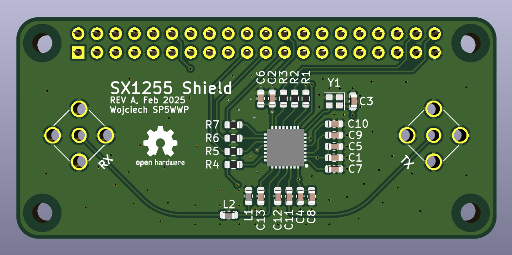

[![CC BY-NC-SA 4.0][cc-by-nc-sa-shield]][cc-by-nc-sa]

# SX1255_HAT-hw
Raspberry Pi Zero shield with the SX1255 RF transceiver chip.



## Usage
### RPi sample config code
Sample Raspberry Pi code for SX1255 control can be found [here](https://github.com/M17-Project/LinHT-utils/tree/main/sx1255).<br>
[I2S slave overlay](https://github.com/AkiyukiOkayasu/RaspberryPi_I2S_Slave) is required. Sample rate for both RX and TX can be set to 125, 250, or 500kHz.

RX/TX frequency setting (500kHz sample rate):
```
./sx1255-spi -s 500 -r 435000000 -t 438000000
```

### Example RX with ZeroMQ
```
arecord -t raw -f S32_LE -r 192000 -c 2 --device="hw:0,1" | ./int_to_short | ./zmq-pub
```

In which `int_to_short` is a simple `int` to `short` format converter:
```C
while(1)
{
  ioctl(STDIN_FILENO, FIONREAD, &rcvd);
  if(rcvd>0)
  {
    if(read(STDIN_FILENO, inp, rcvd)==rcvd)
    {
      for(int i=0; i<rcvd; i+=8)
      {
        memcpy(&out[i/2  ], &inp[i  +2], 2);
        memcpy(&out[i/2+2], &inp[i+4+2], 2);
      }

      write(STDOUT_FILENO, out, rcvd/2);
    }
  }
}
```

### Example TX with ZeroMQ
```
./zmq-sub 192.168.50.243:17018 | aplay -t raw -f S32_LE -r 192000 -c 2 --device="hw:0,0"
```

## Example GNU Radio flowgraphs
There are 2 demo flowgraphs available:
- [*cari_sx1255_rx_demo.grc*](https://github.com/M17-Project/CARI/blob/main/gr_demos/cari_sx1255_rx_demo.grc)
- [*cari_sx1255_multicarrier_tx_demo.grc*](https://github.com/M17-Project/CARI/blob/main/gr_demos/cari_sx1255_multicarrier_tx_demo.grc)

The RX demo also provides a set of sinc compensating FIR filter taps through the `Decimating FIR Filter` block.

## License
This work is licensed under a
[Creative Commons Attribution-NonCommercial-ShareAlike 4.0 International License][cc-by-nc-sa].

[![CC BY-NC-SA 4.0][cc-by-nc-sa-image]][cc-by-nc-sa]

[cc-by-nc-sa]: http://creativecommons.org/licenses/by-nc-sa/4.0/
[cc-by-nc-sa-image]: https://licensebuttons.net/l/by-nc-sa/4.0/88x31.png
[cc-by-nc-sa-shield]: https://img.shields.io/badge/License-CC%20BY--NC--SA%204.0-lightgrey.svg
